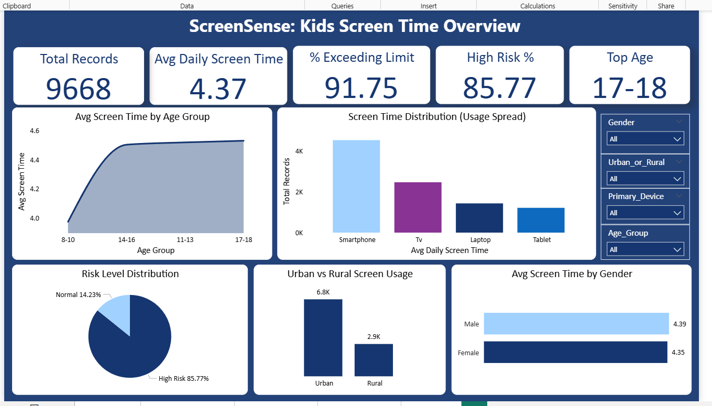
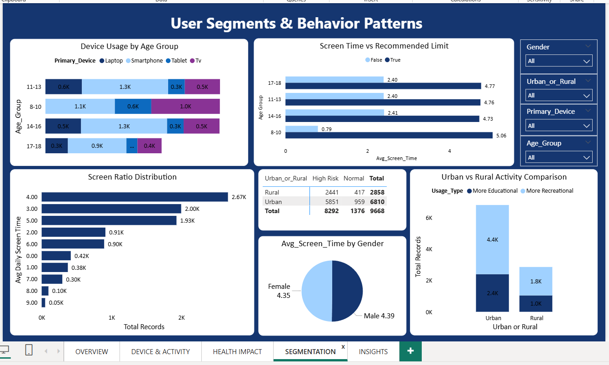
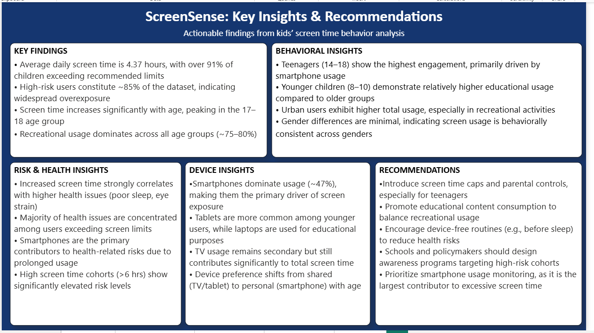

# 📱 ScreenSense: Kids Screen Time Behavior Analysis


---

## 🟢 1. Background & Overview

### Business Context

Children's screen time has become a critical public health concern globally. Stakeholders — including parents, schools, health organizations, and policymakers — lack consolidated, data-driven visibility into **how much time children spend on screens, which devices drive the most exposure, and what measurable health outcomes result from overuse.**

The objective of this analysis is to **identify key behavioral drivers of excessive screen time** among children aged 8–18, segment users by risk level, and surface actionable recommendations that organizations can act on immediately.

### Business Questions Being Answered

- Which age groups are most at risk of screen overexposure?
- What devices are driving the highest screen time?
- Is there a meaningful difference between urban and rural usage behavior?
- What health impacts correlate with excessive screen time — and in which demographics?
- How can screen time be redistributed toward educational use?

### Stakeholders

| Stakeholder | Interest |
|-------------|----------|
| Parents & Guardians | Understand their child's risk profile |
| Schools & Educators | Design intervention programs |
| Health Organizations | Identify at-risk cohorts |
| Policymakers | Build evidence-based screen time regulation |

---

## 🔵 2. Data Structure

### Dataset Overview

The dataset contains **9,668 records** of children's screen time behavior collected across urban and rural settings, covering multiple devices, age groups, and health impact indicators.

### Entity Relationship Overview

```
┌──────────────────────┐         ┌──────────────────────┐
│      Child Profile   │         │    Screen Session     │
│──────────────────────│         │──────────────────────│
│ Age_Group            │────────▶│ Avg_Daily_Screen_Time │
│ Gender               │         │ Primary_Device        │
│ Urban_or_Rural       │         │ Usage_Type            │
│                      │         │ Exceeded_Limit (Y/N)  │
└──────────────────────┘         └──────────┬───────────┘
                                            │
                                            ▼
                                 ┌──────────────────────┐
                                 │    Health Outcome     │
                                 │──────────────────────│
                                 │ Health_Impact         │
                                 │ Risk_Level            │
                                 │ (Poor Sleep /         │
                                 │  Eye Strain /         │
                                 │  Anxiety /            │
                                 │  Obesity Risk /       │
                                 │  No Impact)           │
                                 └──────────────────────┘
```

### Table Explanation

| Column | Description |
|--------|-------------|
| `Age_Group` | Child's age bracket: 8–10, 11–13, 14–16, 17–18 |
| `Gender` | Male / Female |
| `Urban_or_Rural` | Geographic setting of the child |
| `Primary_Device` | Main device used: Smartphone, TV, Laptop, Tablet |
| `Avg_Daily_Screen_Time` | Average hours per day spent on screens |
| `Usage_Type` | More Educational / More Recreational |
| `Exceeded_Limit` | Whether the child exceeded recommended daily screen time |
| `Risk_Level` | High Risk / Normal — derived from screen time thresholds |
| `Health_Impact` | Reported health outcome tied to screen usage |

---

## 🟡 3. Executive Summary

> 💡 **Bottom Line:** Nearly all children in this dataset are overexposed to screens. The problem is not a fringe issue — it is systemic, age-accelerated, and device-concentrated. Immediate intervention is warranted.

### Dashboard — Kids Screen Time Overview


### Top 4 Findings at a Glance

- 🔴 **91.75% of children exceed recommended screen time limits** — overexposure is the norm, not the exception
- 📱 **Smartphones account for 47% of all screen exposure** — a single device type is driving the crisis
- 😴 **Poor sleep is the #1 health consequence**, affecting 2,260+ children — more than anxiety, eye strain, and obesity risk combined
- 📈 **Screen time grows with age** — the 17–18 group averages 4.77 hrs/day, with the 8–10 group showing the highest overage rate relative to their recommended limit

---

## 🟣 4. Insights Deep Dive

---

### 🔍 Insight 1: Screen Overexposure Is Near-Universal

**Data Proof:** 8,874 out of 9,668 children exceed daily screen time limits (91.75%). Only 794 children (8.25%) fall within safe usage.

**Explanation:** This is not a behavioral outlier problem — it reflects a structural gap between recommended guidelines and real-world usage. The recommended limit is being treated as invisible by the vast majority of children across all demographics.

---

### 🔍 Insight 2: Age Accelerates Risk — But Younger Kids Overshoot More

**Data Proof:**

| Age Group | Avg Screen Time (Exceeded Limit) | Avg Screen Time (Within Limit) |
|-----------|----------------------------------|-------------------------------|
| 8–10 | 5.06 hrs | 0.79 hrs |
| 11–13 | 4.76 hrs | 2.40 hrs |
| 14–16 | 4.73 hrs | 2.41 hrs |
| 17–18 | 4.77 hrs | 2.40 hrs |

**Explanation:** Children aged 8–10 who exceed limits average 5.06 hrs — the highest of any group. This suggests the youngest cohort is most underprotected despite having the strictest recommended limits.

---

### 🔍 Insight 3: Smartphones Are the Primary Risk Vector

**Data Proof:** Smartphones = 47% of device usage. TV = 26%. Laptop = 15%. Tablet = 13%. Average screen time on smartphones = 4.4 hrs/day.

**Explanation:** Smartphones combine portability, personal ownership, and always-on connectivity — making them harder to regulate than shared devices like TVs or tablets. Device preference shifts from shared (TV/tablet) to personal (smartphone) as children age, explaining why risk remains persistently high through the teen years.

### Dashboard — Device & Activity Analysis


---

### 🔍 Insight 4: Recreational Usage Dominates — Educational Use Is the Exception

**Data Proof:**

| Age Group | Educational % | Recreational % |
|-----------|--------------|----------------|
| 8–10 | 72.90% | 27.10% |
| 11–13 | 22.50% | 77.50% |
| 14–16 | 21.31% | 78.69% |
| 17–18 | 20.55% | 79.45% |

**Explanation:** The 8–10 group is the **only age group** where educational usage naturally dominates — likely due to parental supervision. From age 11 onwards, recreational usage takes over permanently. This transition window (ages 10–11) is the most critical point for behavioral intervention.

---

### 🔍 Insight 5: Urban & Rural Children Face Identical Risk Rates

**Data Proof:** Urban high-risk rate = 85.9% (5,851 of 6,810). Rural high-risk rate = 85.4% (2,441 of 2,858).

**Explanation:** Urban children account for 70% of the dataset volume, but the *risk rate* is nearly identical across both settings. Rural children face the same behavioral risk profile — they are simply underrepresented in the data, not safer.

### Dashboard — User Segments & Behavior Patterns


---

### 🔍 Insight 6: Poor Sleep Is the Dominant Health Casualty

**Data Proof:**

| Health Impact | Count |
|---------------|-------|
| No Health Impact | 3,180 |
| Poor Sleep | 2,260 |
| Eye Strain | 640 |
| Anxiety | 390 |
| Obesity Risk | 250 |

**Explanation:** Poor sleep is nearly 3.5x more prevalent than the next health impact (eye strain). The 11–13 age group records the highest absolute count of poor sleep cases (665 children), suggesting late-night device use begins in early adolescence.

### Dashboard — Health Impact Analysis


---

## 🔴 5. Recommendations

> Ranked by **impact potential** and **feasibility of implementation.**

### Dashboard — Key Insights & Recommendations


---

### ✅ Rec 1: Deploy Smartphone-First Parental Controls (Highest Priority)

**Target:** All age groups, especially 11–18  
**Action:** Partner with device manufacturers and telecom providers to build parent-managed screen time governors natively into smartphones  
**Why:** Smartphones drive 47% of total exposure and are the hardest to regulate without system-level controls. Voluntary compliance alone has clearly failed — 91.75% exceedance proves it.

---

### ✅ Rec 2: Protect the 8–10 Educational Window

**Target:** Children aged 8–10 and their parents  
**Action:** Design app ecosystems and school tablet programs that default to educational content during this age window — before recreational habits solidify  
**Why:** This is the only cohort where educational usage naturally dominates (72.9%). Losing this window results in the permanent recreational shift visible from age 11 onward.

---

### ✅ Rec 3: Launch a Sleep-Focused "Screens Off" Campaign

**Target:** All age groups  
**Action:** Introduce mandatory device-free hours before bedtime (e.g., 9 PM cutoff) enforced via smart home integrations and school wellness programs  
**Why:** Poor sleep is the #1 health consequence (2,260 cases). Sleep disruption compounds into academic, emotional, and physical health problems — the highest-leverage single intervention point.

---

### ✅ Rec 4: Equalize Rural Intervention Coverage

**Target:** Rural schools and community centers  
**Action:** Extend digital wellness resources and monitoring tools equally to rural settings — not just urban centers  
**Why:** Rural children carry an 85.4% high-risk rate, nearly identical to urban peers, but are likely receiving disproportionately less institutional support.

---

### ✅ Rec 5: Add Screen Time as a Standard School Health Metric

**Target:** Schools and policymakers  
**Action:** Integrate screen time tracking into annual student health assessments alongside BMI and vision checks  
**Why:** 85.77% of children qualify as high-risk, yet no standardized school-level monitoring exists. This institutional blind spot needs closing.

---

## ⚫ 6. Caveats & Assumptions

> Transparency about limitations is what separates analysts from data reporters.

| # | Caveat | Impact on Analysis |
|---|--------|--------------------|
| 1 | **No timestamp data available** — usage is not broken down by time of day | Cannot confirm whether usage spikes at night (most health-critical window) |
| 2 | **Health impact is self/proxy-reported, not clinically validated** | May underreport actual consequences; anxiety and obesity risk are harder to self-identify |
| 3 | **"Educational" vs "Recreational" is binary** — mixed-use sessions are not captured | YouTube for homework may be miscategorized as recreational |
| 4 | **Dataset is cross-sectional, not longitudinal** — no before/after tracking | Correlation between screen time and health outcomes cannot be confirmed as causation |
| 5 | **Urban/Rural split is 70/30** — may reflect sampling bias | Rural insights are less statistically robust due to smaller sample size |
| 6 | **No socioeconomic data included** | Device access and usage behavior may be income-driven; recommendations may need income-stratified adjustments |

---

## 🛠️ Tools Used

| Tool | Purpose |
|------|---------|
| **Python** (Pandas, Seaborn, Matplotlib) | Data cleaning, EDA, statistical analysis |
| **Jupyter Notebook** | Analysis environment |
| **Microsoft Power BI** | Interactive 4-page dashboard + insights summary |
| **Excel / CSV** | Raw dataset storage |

---

## 📁 Repository Structure

```
ScreenSense-Kids-Screen-Time/
│
├── 📓 Data_Analysis.ipynb          # Jupyter Notebook — full EDA & analysis
├── 📊 Dashboard.pbix               # Interactive Power BI Dashboard
├── 📄 Dashboard.pdf                # Static PDF export of dashboard
├── 📁 Dataset.xlsx                 # Raw dataset (Excel)
├── 📁 Indian_Kids_Screen_Time.csv  # Raw dataset (CSV)
├── 🖼️ Overview.png                 # Dashboard Page 1 screenshot
├── 🖼️ Device & Activity.png        # Dashboard Page 2 screenshot
├── 🖼️ Health impact.png            # Dashboard Page 3 screenshot
├── 🖼️ Segmentation.png             # Dashboard Page 4 screenshot
├── 🖼️ Insights.png                 # Dashboard Page 5 screenshot
└── 📝 README.md                    # Project documentation
```

---

## 👤 Author

**Seema**  
Aspiring Data Analyst | Internship Project

[](https://www.linkedin.com/in/seema-kumari-375763308/)
[](https://github.com/seema-kri)

---

> *"Data without insight is just noise. Insight without action is just trivia."*
